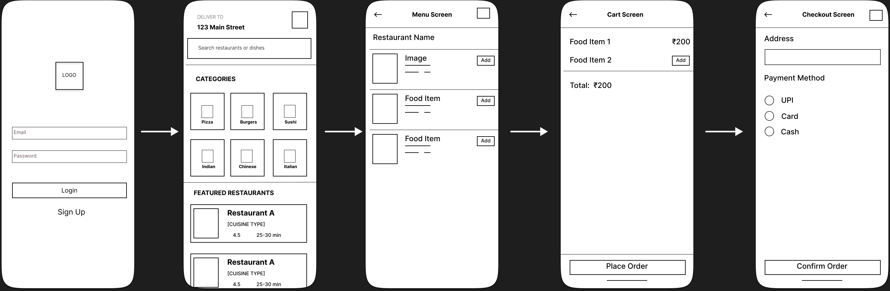
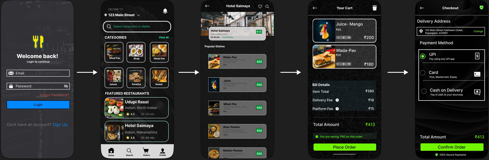

# CodeAlpha UI/UX Internship

This repository contains all the tasks completed during my UI/UX Internship at CodeAlpha. The focus of this internship is on understanding UI/UX design principles, wireframing, and creating visually appealing user interfaces.

---

## Task 1: Wireframing & Low-Fidelity Design

### Project: Food Delivery Mobile App

Designed low-fidelity wireframes to establish the basic structure, layout, and user flow of a food delivery application.

### Screens Included:
- Login Screen  
- Home Screen  
- Menu Screen  
- Cart Screen  
- Checkout Screen  

### Tools Used:
- Figma  

### Preview:

### Key Learnings:
- Understanding user flow and navigation  
- Creating low-fidelity wireframes  
- Structuring mobile UI layouts effectively  
- Planning user interaction before visual design  

---

## Task 2: High-Fidelity UI Design

### Project: Food Delivery Mobile App (UI Design)

Converted the low-fidelity wireframes into a high-fidelity UI design by applying visual elements and design principles.

### Improvements Made:
- Applied color palette and visual hierarchy  
- Added typography and consistent font styles  
- Designed interactive buttons and icons  
- Integrated images for better user experience  
- Improved spacing, alignment, and overall aesthetics  

### Tools Used:
- Figma  

### Preview:

### Key Learnings:
- Applying UI/UX design principles  
- Creating visually appealing interfaces  
- Maintaining consistency in design systems  
- Enhancing user experience through design  

---

## Task 3: (Upcoming)

Details of Task 3 will be added soon.

---

## Conclusion

This internship helped me understand the complete UI/UX design process—from wireframing to high-fidelity design—while improving my skills in Figma and user-centered design.
