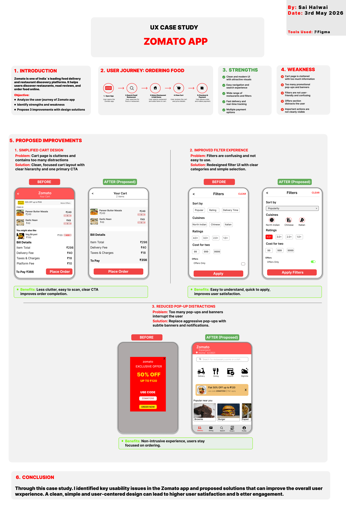

# CodeAlpha UI/UX Internship

This repository contains all the tasks completed during my UI/UX Internship at CodeAlpha. The focus of this internship is on understanding UI/UX design principles, wireframing, and creating visually appealing and user-friendly interfaces.

---

## Task 1: Wireframing & Low-Fidelity Design

### Project: Food Delivery Mobile App

Designed low-fidelity wireframes to establish the basic structure, layout, and user flow of a food delivery application.

### Screens Included:

* Login Screen
* Home Screen
* Menu Screen
* Cart Screen
* Checkout Screen

### Tools Used:

* Figma

### Preview:

### Key Learnings:

* Understanding user flow and navigation
* Creating low-fidelity wireframes
* Structuring mobile UI layouts effectively
* Planning user interaction before visual design

---

## Task 2: High-Fidelity UI Design

### Project: Food Delivery Mobile App (UI Design)

Converted low-fidelity wireframes into a high-fidelity UI design by applying visual elements and design principles.

### Improvements Made:

* Applied color palette and visual hierarchy
* Added typography and consistent font styles
* Designed interactive buttons and icons
* Integrated images for better user experience
* Improved spacing, alignment, and overall aesthetics

### Tools Used:

* Figma

### Preview:

### Key Learnings:

* Applying UI/UX design principles
* Creating visually appealing interfaces
* Maintaining consistency in design systems
* Enhancing user experience through design

---

## Task 3: UX Case Study – Zomato App

### Introduction

This case study analyzes the user experience of the Zomato App, a popular food delivery platform. The goal is to identify usability issues and propose design improvements to enhance the overall user experience.

---

### Objectives

* Analyze the user journey
* Identify strengths and weaknesses
* Propose design improvements

---

### User Journey

1. Open App
2. Search Food/Restaurant
3. Select Restaurant & Add Items
4. View Cart
5. Checkout & Payment

---

### Strengths

* Clean and modern UI with attractive visuals
* Easy navigation and search experience
* Wide range of restaurants and filters
* Fast delivery with real-time tracking
* Multiple payment options

---

### Weaknesses

* Cart page is cluttered with too much information
* Too many promotional pop-ups and banners
* Filters are confusing and not user-friendly
* Offers section distracts users
* Important actions are not clearly visible

---

### Proposed Improvements

#### 1. Simplified Cart Design

* Problem: Cart page is cluttered and distracting
* Solution: Clean layout with clear hierarchy and a single primary CTA
* Benefit: Easier to scan and faster checkout

---

#### 2. Improved Filter Experience

* Problem: Filters are complex and hard to use
* Solution: Redesigned filter UI with clear categories and simple selection
* Benefit: Faster and more intuitive browsing

---

#### 3. Reduced Pop-up Distractions

* Problem: Frequent pop-ups interrupt user flow
* Solution: Replace pop-ups with subtle banners and notifications
* Benefit: Smooth and distraction-free experience

---

### Preview:

---

### Conclusion

Through this case study, key usability issues in the Zomato app were identified and improved with practical design solutions. A clean, simple, and user-centered design approach can significantly enhance user satisfaction and engagement.

---

## Tools Used

* Figma

---

## Submission Details

* Name: Sai Halwai
* Date: 3rd May 2026

---

## Final Thoughts

This internship provided hands-on experience in the complete UI/UX design process—from wireframing to high-fidelity design and UX case study analysis. It helped me improve my design thinking and ability to create user-centered solutions.
